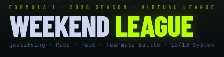
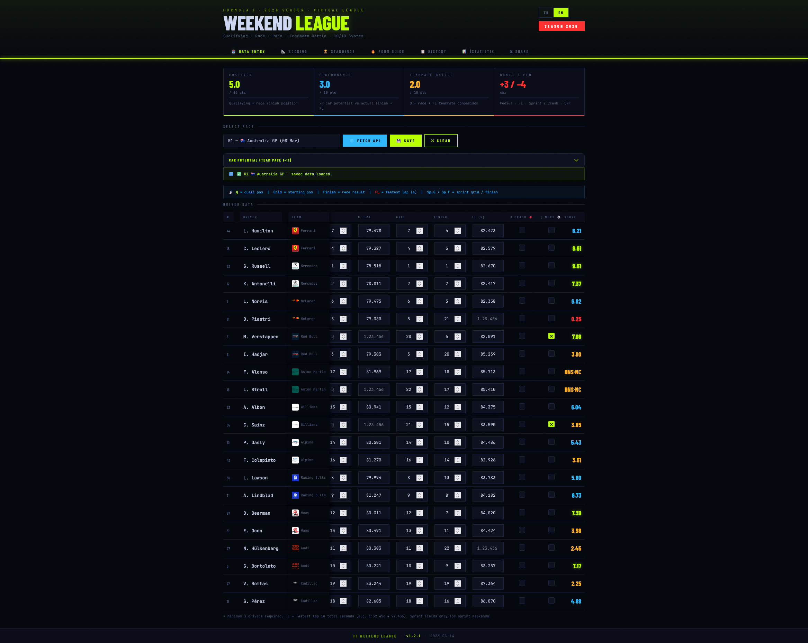
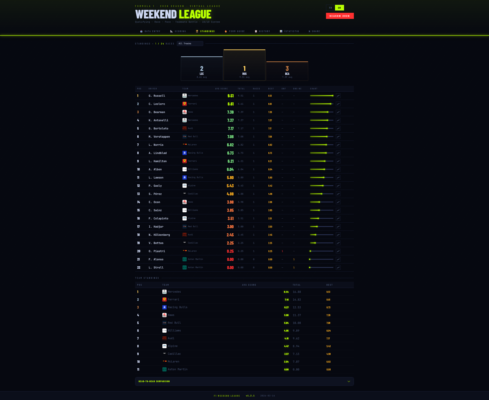

# F1 Hafta Sonu Ligi 2026 🏎️

F1 Hafta Sonu Ligi, Formula 1 pilotlarının 2026 sezonu boyunca gösterdikleri performansları değerlendiren ve takip eden bir web uygulamasıdır. Mutlak pozisyonlar, araç potansiyelleri (Beklenen Pozisyon - xP), takım arkadaşı mücadeleleri ve sprint hafta sonlarını dikkate alan özel, 10 puanlık detaylı bir skorlama sistemine sahiptir.

[Click here for English README](README.md)

## 📖 Proje Hakkında
Bu projenin amacı, Formula 1'deki araç performans farklarından doğan eşitsizlikleri ortadan kaldırmaktır. Her aracın saf hızına dayalı bir "Beklenen Pozisyon (xP)" belirlenerek, pilotlar sadece yarışı nerede bitirdiklerine göre değil, altlarındaki araca kıyasla ne kadar iyi performans gösterdiklerine ve takım arkadaşlarına sağladıkları üstünlüğe göre puanlanırlar.

## ✨ Temel Özellikler
- **10-Puanlık Değerlendirme Motoru:** Aşağıdaki kriterlere dayanan adil bir algoritma:
  - **Pozisyon (5.0 Puan):** Araç potansiyeline göre sıralama (Q) performansı & Yarış bitiş pozisyonu.
  - **Performans (3.0 Puan):** Beklenen pozisyona göre yarış içi yükseliş/düşüş & En hızlı tur temposu.
  - **Takım Savaşı (2.0 Puan):** Araç potansiyellerini eşitlemek için takım içi Q, Yarış ve FL karşılaştırması.
  - **Bonus (+3.0 maks) & Ceza (-4.0 maks):** Pilot hataları (DNF), mekanik arızalar, sprint kazanımları.
- **Jolpi F1 API Entegrasyonu:** Yarış verilerini manuel girmek yerine tek tuşla doğrudan API üzerinden çekin.
- **Çift Dil Desteği:** İngilizce ve Türkçe arasında kesintisiz (native) geçiş yapın.
- **İnteraktif Tablolar:** Sezon genel sıralaması, Form (Güç Sıralaması), Kafa Kafaya (H2H) karşılaştırmaları, istatistikler ve detaylı puanlama kuralları açıklamaları.
- **Export/Import (Yedekleme):** Tüm sezon verilerinizi yerel olarak bir JSON dosyasıyla indirin veya yükleyin.
- **Sosyal Medya Paylaşımı:** HTML Canvas ile doğrudan 𝕏 (Twitter) için özel sıralama görseli oluşturun ve PNG olarak indirin.

## 🔄 Versiyon Geçmişi ve Geliştirmeler

### [v1.2.1] — 2026-03-14
**Yenilikler:**
- **Sticky Pilot Sütunları:** Veri giriş tablosunda yatay kaydırmada numara, isim ve takım sütunları solda sabit kalıyor; kimin verisini girdiğinizi kaybetmezsiniz.
- **Sticky Puan Önizlemesi:** Canlı puan sütunu sağda sabit kalıyor — isim solda, puan sağda her zaman görünür.
- **Dinamik Sprint Sütunları:** Normal yarışlarda sprint sütunları otomatik gizleniyor; sadece sprint hafta sonlarında ortaya çıkıyor.
- **Pace Map Hafızası:** Yeni bir yarış seçildiğinde araç potansiyeli sıralaması önceki yarıştan otomatik yükleniyor, sadece değişen takımları güncellemek yeterli.

**Denge Düzenlemeleri:**
- `racePts`, `qualPts` ve `craftPts` değerleri için maksimum sınır ve azalış oranları (decay) güncellendi. Backmarker'ların (arka sıra takımları) xP bonusunun, frontrunner'ların (ön sıra takımları) mutlak pozisyon puanını geçmesini önlemek için düzenlemeler yapıldı. Toplam 10 puan sistemi korundu.

**Düzeltmeler:**
- Araç potansiyeli tablosunun bozulması düzeltildi (sticky stillerin sadece veri tablosuna etki etmesi sağlandı).

### [v1.2.0] — 2026-03-14
**Yenilikler:**
- **Modüler Mimari:** Büyük `app.js` dosyası 5 farklı modüle bölündü (`data.js`, `i18n.js`, `scoring.js`, `ui.js`, `canvas.js`, `stats.js`).
- **Detaylı İstatistikler:** Pilotların sezon genelindeki özel başarılarını (Q King, Podyum Ustası, Hız İblisi vb.) gösteren yepyeni bir "İstatistik" sekmesi eklendi.
- **Dinamik Puan Renkleri:** Sıralama ve Form tablolarındaki puanlar başarı seviyesine göre (Yeşil → Kırmızı) dinamik renklendiriliyor.
- **Geliştirilmiş UI:** "Araç Potansiyeli" bölümü artık daha az yer kaplayan açılır-kapanır (accordion) bir yapıda tasarlandı.

### [v1.0.0] — İlk Sürüm — 2026-03-14
- 10/10 puanlama motoru temel bileşenleri (Pozisyon, Performans, Takım Savaşı) eklendi.
- Sıralama performansı için araç potansiyeli (xP) sistemi eklendi.
- Sprint hafta sonu desteği entegre edildi.
- DNF·P / DNF·NC / DNS·P / DNS·NC arıza/kaza ayrımları yapıldı.
- Jolpi F1 API entegrasyonu sağlandı.
- Çift dil desteği (TR / EN) eklendi.
- Sezonluk sıralama, form durumu listesi, kafa kafaya karşılaştırma ekranları eklendi.
- 𝕏 (Twitter) paylaşımı için Canvas bazlı görsel oluşturucu eklendi.
- JSON Export / Import yedekleme özelliği kuruldu.

## 🚀 Canlı Demo
*(Projeyi GitHub Pages ile yayınladıktan sonra linki buraya ekleyebilirsiniz: `https://<kullanici-adiniz>.github.io/f1-league`)*

## 🛠️ Teknolojiler
- **HTML5 & CSS3** (Özel UI tasarımı, Vanilla CSS)
- **Vanilla JavaScript (ES6)** (Sıfır bağımlılıklı modüler yapı)
- **Chart.js** (Pilot performans grafikleri için)

## 📦 Kurulum ve Kullanım
Proje istemci tarafında (client-side) çalışan, derleme (build) işlemine veya NODE/backend sunucusuna ihtiyaç duymayan saf JavaScript ile geliştirilmiştir:
1. Repoyu bilgisayarınıza klonlayın: `git clone https://github.com/your-username/f1-league.git`
2. Klasörü bilgisayarınızda açın.
3. Modern bir tarayıcıda `index.html` dosyasına çift tıklayın veya VS Code'da 'Live Server' eklentisi ile çalıştırın.

## 🤝 Katkıda Bulunma
Bu uygulama tamamen kendi kişisel F1 tutkumla, yarışların ve pilot performanslarının daha adil değerlendirilmesi amacıyla geliştirdiğim bağımsız (hobi) bir projedir.

Bu yüzden projeyi her türlü **fikre, tavsiyeye ve kod geliştirmesine** tamamen açık tutuyorum. Özellikle şunlar için geri bildirimlerinize (Issue açmanıza ya da Pull Request yollamanıza) çok sevinirim:
- *"X pilotu o yarışta bence böyle puanlanmalıydı, xP hesaplamasına şu da eklenebilir"* gibi **Puanlama & Denge tartışmaları**.
- Yeni istatistik kartları veya UI/UX arayüz iyileştirmeleri.
- Bug (hata) bildirimleri.

Projeye yıldız (⭐️) vererek veya yeni fikirler sunarak bu ufak sanal ligi birlikte çok daha keyifli bir hale getirmeme yardımcı olabilirsiniz!
